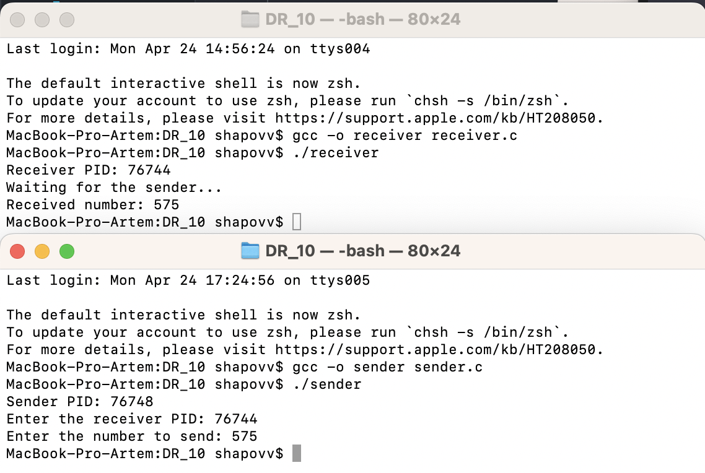

# ДР_10
## Шаповалов Артём | БПИ-217

**Задание**

Побитовая передача целого числа от одного процесса другому с помощью сигналов SIGUSR1, SIGUSR2. Необходимо написать две программы — передатчик и приемник, которые будут запускаться с разных терминалов. Каждая программа вначале печатает свой.

PID и запрашивает ввод с клавиатуры PID программы–собеседника (вводится пользователем). Порядок ввода PID не имеет значения. Программа—передатчик запрашивает с клавиатуры ввод целого десятичного числа (число может быть и отрицательным!). Введенное число побитово передается программе-приемнику с использованием пользовательских сигналов SIGUSR1 и SIGUSR2. Программа–приемник после завершения приема печатает принятое число в десятичной системе счисления.

**Решение**

Реализованы две программы: отправитель - [sender.c](sender.c) и получатель - [receiver.c](receiver.c)

Комментарии содержатся в соответствующих файлах программ.

**Компиляция и запуск исполняемых файлов:**

Сначала важно скомпилировать и запустить программы клиента, а затем сервера.

В первом окне терминала:
```{c}
gcc -o receiver receiver.c
./receiver
```
Во втором окне терминала:
```{c}
gcc -o sender sender.c
./sender
```

**Пример работы программы:**



